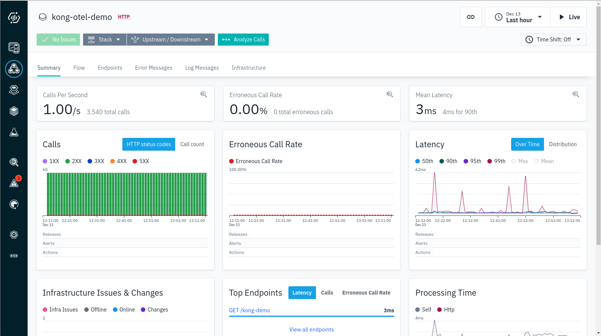

# Instana Kong Tracing Demo

This repository contains a demo for Instana's [Kong](https://konghq.com/) tracing functionality.
Also Kong monitoring is shown.

## Prerequisites

A `docker-compose` installation running on your machine. This demo has been created and tested on Linux with `docker-compose`.

## Configure

Create a `.env` file in the root of the checked-out version of this repository and enter the following text, with the values adjusted as necessary:

```text
agent_key=<TODO FILL IN>
agent_endpoint=<local ip or remote host; e.g., ingress-red-saas.instana.io>
agent_endpoint_port=<443 already set as default; or 4443 for local>
agent_zone=<name of the zone for the agent; default: kong-tracing-demo>
```

In most scenarios only the fields `agent_key` and `agent_endpoint` are required.

A template [.env.template](.env.template) can be copied to `.env` for your convenience.

## Build & Launch

```bash
docker-compose build
docker-compose up
```

This will build and launch

- `client-app` service, a simple Spring Boot application that issues a request every second to the ...
- `kong` service, which routes all incoming requests to the ...
- `server-app` service, a simple Spring Boot application that returns `200` to any HTTP request.

After the agent is bootstrapped and starts accepting spans from Kong, the resulting traces in the Analyze view will look like the following:




Naturally, all the other [Kong capabilities of Instana](https://www.ibm.com/docs/en/instana-observability/current?topic=technologies-monitoring-kong-api-gateway-beta)
will work out of the box as well ;-)

## Set up an Application Perspective for the Demo

The simplest way is just to assign to the agent a unique zone (the `docker-compose.yml` file comes with the pre-defined `kong-tracing-demo` zone), and simply create the application to contain all calls with the `agent.zone` tag to have the value `kong-tracing-demo`.

## Set up Kong tracing in your own environment

Configuration depends on the way how Kong is set up. This demo uses the db-less mode with a declarative configuration YAML.
These steps do the same. You might want to use the Kong admin interface directly via `curl` or Kong manager (admin GUI) instead.

* Route requests through Kong first by defining services and routes in Kong configuration
* Then enable request tracing at 100% sampling in `kong.conf`:
```
tracing_instrumentations = request
tracing_sampling_rate = 1.0
```
* Enable and configure the Kong OpenTelemetry plugin (assuming `kong.yml` here):
```
plugins:
- name: opentelemetry
  config:
    endpoint: "https://instana-agent:4318/v1/traces"
    resource_attributes:
      service.name: "kong-otel"
```
* Enable and configure the Instana agent OpenTelemetry plugin (`configuration.yaml`):
```
# OpenTelemetry (https://www.ibm.com/docs/en/instana-observability/current?topic=tracing-opentelemetry)
com.instana.plugin.opentelemetry:
  enabled: true   # legacy setting, will only enable grpc, defaults to false
  grpc:
    enabled: true # takes precedence over legacy settings above, defaults to true if "grpc:" is present
  http:
    enabled: true # allows to enable http endpoints, defaults to true if "http:" is present
```

## Set up Kong monitoring in your own environment

* Enable and configure the Instana agent Kong plugin (`configuration.yaml`):
```
com.instana.plugin.kong:
  remote:                   # Multiple configurations can be specified
    - host: 'kong-gateway'  # Kong server host or IP address.
      port: '8001'          # Admin API port (default is 8444). In case of basic authentication, it is a proxy port.
      protocol: 'http'      # ['https' or 'http']. Default is 'https'. Protocol to access Kong Admin API.
      availabilityZone: 'kong_az'   # default is 'kong_az' - a separate Kong host appears on infrastructure map
```

## Known issues

### Flow graph incorrect

Expected:


Seen flow graphs instead:

Client view:


Server view:


### Call order in "Analytics -> Calls" incorrect

Kong is expected to appear in the middle. But it appears as the last span instead:


### Unmonitored entity in Application -> Infrastructure


## Debugging

### Instana agent debug logging

Set the Instana agent log level by changing variable `agent_log_level` in the
`.env` file. The default value is `INFO`.

Example:
```
agent_log_level=DEBUG
```

Generated Instana agent logs can be found in `agent/log/`.

Enable the debug logging of traces in the Instana agent by uncommenting the following
in the file `agent/com.instana.agent.main.sender.File.cfg`:
```
prefix=local
type=traces
```
By default, the trace debug logging is enabled.
The traces are generated as `agent/log/local-<timestamp>.log`.
